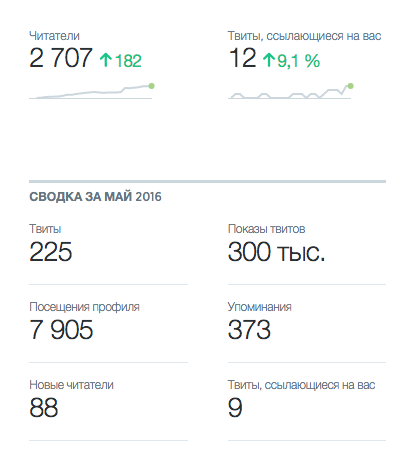
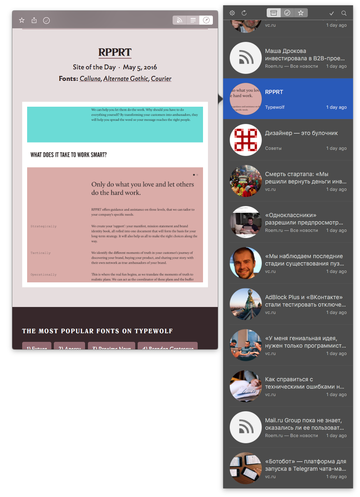
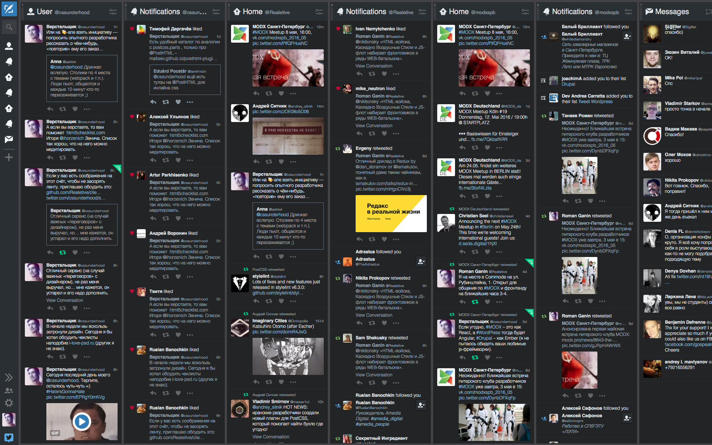
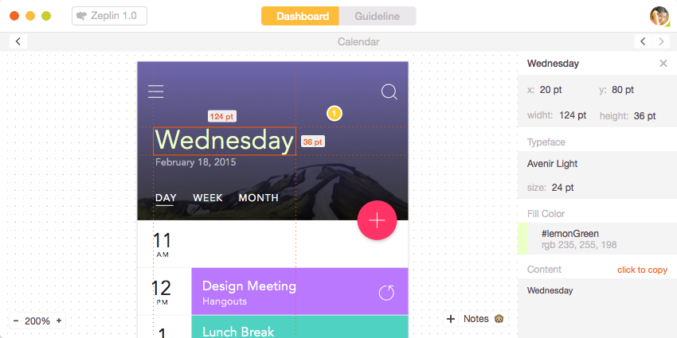
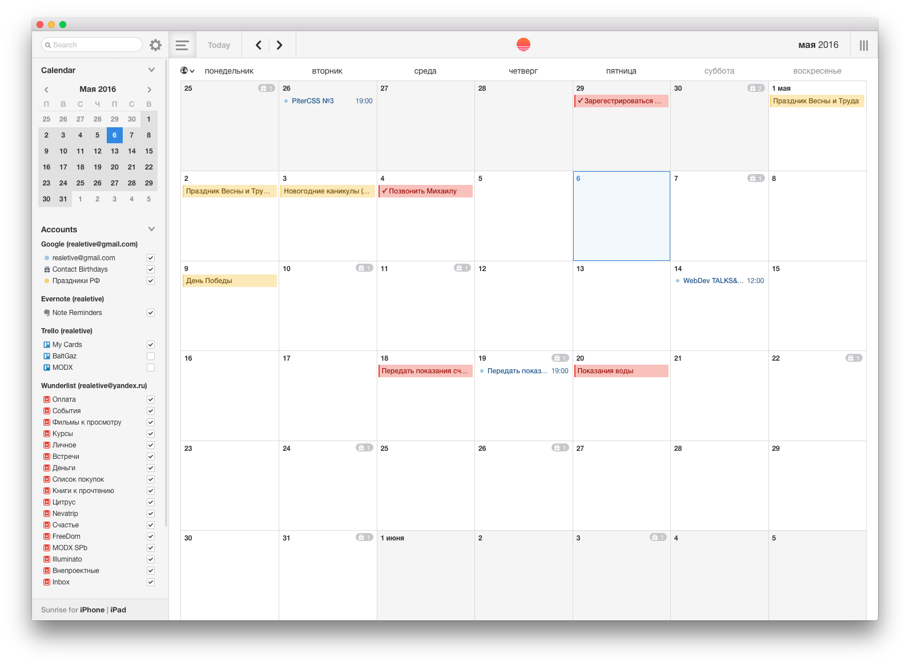
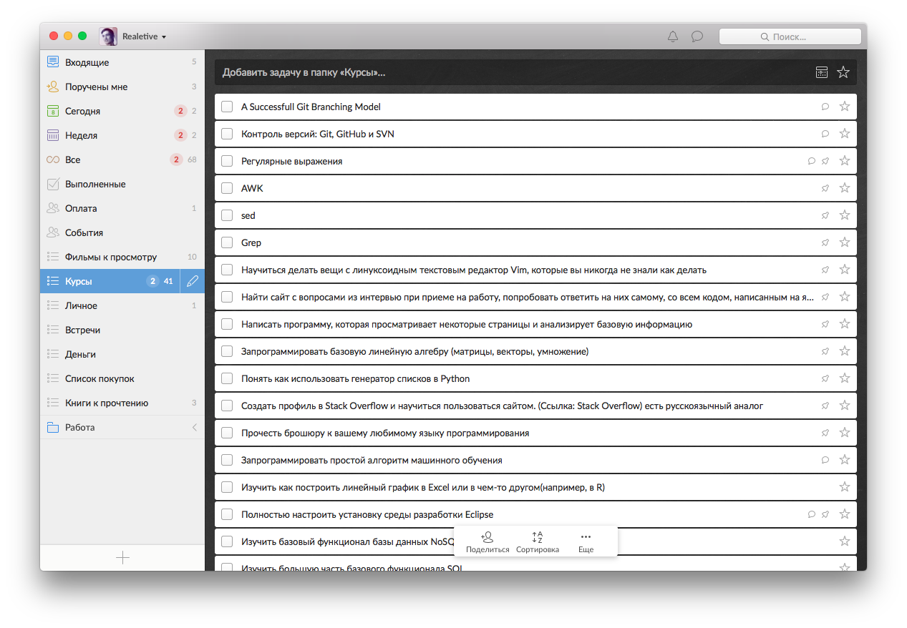
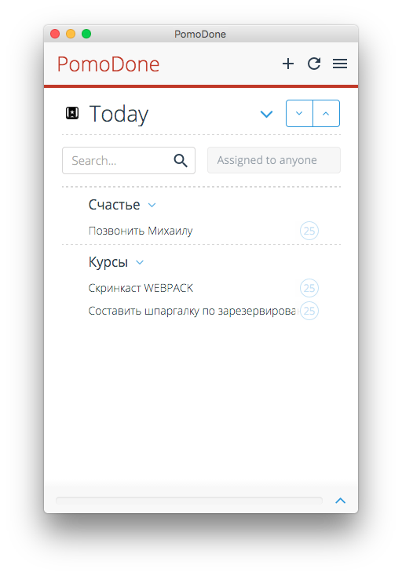
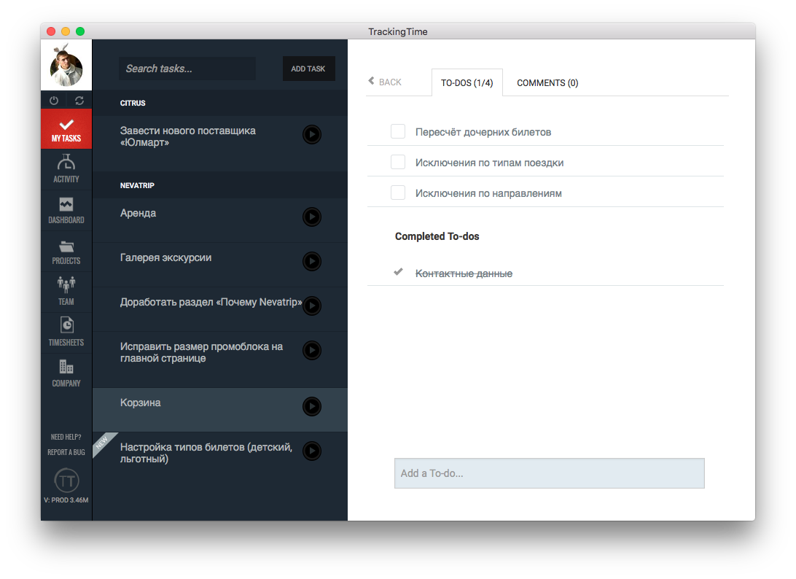

CSSUnderhood. Неопубликованное
==============================

Эта своеобразная статья — список тех материалов, которые я по тем или иным причинам не включил в основную ленту [@cssunderhood](//cssunderhood.ru/realetive).

> У меня нет и не было цели кого-то учить — я сам новичёк.

## Делюсь впечатлениями

В целом — я доволен результатом. У меня, как у автора, не было каких-то планов, тайных замыслов и сакральных смыслов. Мне предложили — я согласился. Надеялся на самодисциплинизацию и обмен опытом, что, в принципе, и произошло.

Если верить статистике, то и моё присутствие сказалось на @cssunderhood весьма положительно, я рассчитывал на меньшее:

- - -

Многое из того, о чём я мог (или хотел) рассказать, я просто не успел включить в трансляцию. Но не пропадать же опыту!

Мои подписки
------------

### Подкасты

* [Веб-стандарты](//itunes.apple.com/ru/podcast/veb-standarty/id1080500016?mt=2)
* [The Art of Programming](//itunes.apple.com/ru/podcast/the-art-of-programming/id1046278525?mt=2)
* [Радио-Т](//itunes.apple.com/ru/podcast/radio-t/id256504435?mt=2)
* [Ruby NoName Podcast](//itunes.apple.com/ru/podcast/ruby-noname-podcast/id581390515?mt=2)
* [RadioJS](//itunes.apple.com/ru/podcast/radiojs/id904938655?mt=2)
* [Frontflip](//itunes.apple.com/ru/podcast/frontflip/id884716456?mt=2)
* [SDCast](//itunes.apple.com/ru/podcast/sdcast/id890468606?mt=2)

### Каналы на Youtube

* [4front](//www.youtube.com/channel/UCj3KH8jxwcT5zOrByWmNXhA/videos)
* [FrontendDevConf](//www.youtube.com/user/FrontendDevConf/videos)
* [JSConf](//www.youtube.com/user/jsconfeu/videos) (en)
* [JSib Community](//www.youtube.com/channel/UCmnYKBoddVb6GBlOJpZxFFg/videos)
* [loftblog](//www.youtube.com/user/loftblog/videos)
* [LvivJS Conference](//www.youtube.com/channel/UC6FuC3toXWdpNTVYdFd4quA)
* [MoscowJS](//www.youtube.com/user/moscowjs/videos)
* [SPB Frontend](//www.youtube.com/channel/UCWjDubFXv8I1vWEb47s9_IA/videos)
* [Web Not Bombs](//www.youtube.com/user/webnotbombsvideos/videos)
* [Веб-стандарты](//www.youtube.com/user/wstdays/videos)

### RSS

* [Codrops](//feeds2.feedburner.com/tympanus)
* [TypeWolf](//www.typewolf.com/feed)
* [Roem.ru](//roem.ru/rss/roem-all-news.xml)
* [VC.ru](//vc.ru/feed)
* [Советы Бюро Артемия Горбунова](//artgorbunov.ru/bb/soviet/rss/)
* [Занудный адаптивный блог](//maximilyahov.ru/blog/rss/) Максима Ильяхова о редактуре текста

### Email-подписки

* [Продвинутый курс Главреда](//maximilyahov.ru/glvrd-pro/)
* [Еженедельная рассылка Зелла Лью](//zellwk.com/)

Мои программы
-------------

> Чтобы избежать «непоняток» — я работаю на Mac OS X.

Основной браузер для работы и интернет-сёрфинга — Google Chrome. Очень бы хотел использовать Safari за кил-фичу бокового меню со списком общих ссылок, объединяющий общий поток RSS и твит-ленты, но отвратительная реализация отображения закладок (как в боковом меню, так и в панели вкладок) предопределила его судьбу.

Для RSS использую Newsflow – совсем не мешает основной работе, показывает уведомления, позволяет сохранить избранные посты в отдельную вкладку (некий аналог избранного) и просматривать их полностью, не открывая браузера.

Для Твиттера я использую TweetDeck – он позволяет оперативно отслеживать сразу несколько аккаунтов и их активности.

### Программирование

Как систему контроля версий я предпочитаю GitHub. Помимо [стандартного десктопного клиента](//desktop.github.com/), когда нужен обзорный вид, ветвлёный git flow или дзен на код-ревью, использую [GitKraken](//www.gitkraken.com/).

Текстовый редактор по умолчанию — Sublime Text 3, неспешно постигаю Vim и Emacs (пока только исключительно из-за org-mode). Не вижу смысла расшаривать список плагинов. Каждый из них — это решение каких-то моих проблем, связанных с разработкой. Проблемы у всех разные, глупо делиться проблемами. Вообще не понимаю, почему вокруг этой темы так много хайпа при наличии [github.com/miripiruni/frontdesk](//github.com/miripiruni/frontdesk) или [github.com/sindresorhus/awesome](//github.com/sindresorhus/awesome).

iTerm2 для терминала + `zsh` и `oh my zsh` (`ZSH_THEME="wedisagree"`).

### Графика

Я достаточно уверенно работаю в Adobe Photoshop и Illustrator, но, если дело каcается интерфейсов, то это [Sketch](//www.sketchapp.com/). Готовые макеты удобно обсуждать в [inVision](//www.invisionapp.com/), а верстать — глядя в [Zeplin](//zeplin.io/).

### Продуктивность

[Sunrise Calendar](//calendar.sunrise.am/) позволяет спланировать события из нескольких аккаутов: Google, iCloud, Wunderlist, Evernote, Trello и других.

[Wunderlist](//www.wunderlist.com) – список задач с возможность группировки в категории, подзадачи, назначение ответственных. Есть ещё [Todoist](//ru.todoist.com/) со сходим функционал и не меньшим количеством поклонников.

[PomoDone](//pomodoneapp.com/) – «помидорный» трекер, синхронизируемый с большинством сервисов, включая Wunderlist и Todoist.

[TrackingTime](//trackingtime.co/) – многофункциональный трекер задач для ведения проектов, подсчёта затраченного времени и стоимости. Позволяет контролировать не только личные проекты, но и работу команды.

Мои сервисы
-----------

Не в смысле __мои__, что я их создал, а то, чем я регулярно ими пользуюсь…

[Babe Holder](//babeholder.pixoil.com/) – <abbr title="«Not safe for work», небезопасно для работы">NSFW</abbr>-плейсхолдер картинок для ваших проектов (если заказчик ещё не предоставил контент).

[Colorable](//jxnblk.com/colorable) – сервис и npm-пакет для подбора (и тестирования) котраста цветов по WCAG.

[Paletton](//paletton.com) – помогает подобрать цветовую паллитру по нескольким алгоритмам.

[Virtual machines](//developer.microsoft.com/en-us/microsoft-edge/tools/vms/) от Microsoft – готовые образы виртуальных машин, если надо протестировать вёрстку в различный версиях IE или Edge.

[Screen siz.es](//screensiz.es/) – сводная таблица характеристик экрана различных мониторов, планшетов и смартфонов (если продумываете стратегию ваших `media queries`).

Остались вопросы? Есть, что обсудить? Оставайтесь на связи: [@Realetive](//twitter.com/realetive).

P. S. Мне интересно ваше мнение по поводу создания нового чеклиста для дизайнеров (а также клиентов и разработчиков) по аналогии с [ILovePSD](//i-love-psd.ru/) – __[проект на GitHub](//github.com/Realetive/client-designer-developer)__.